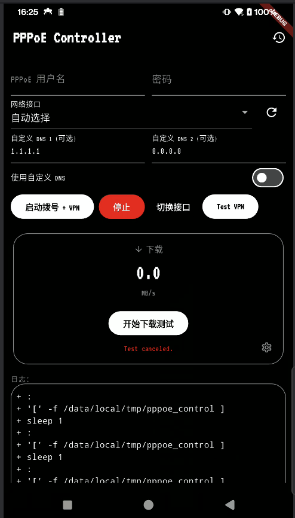

# Android PPPoE Controller

这是一个在 **已 Root** 的 Android 设备上实现 PPPoE 拨号上网的解决方案。

本项目由两部分组成：

1. **Magisk 模块**: 负责在 Root 环境下运行 `pppd` 守护进程，处理底层的 PPPoE 协议和网络接口管理。
2. **Flutter 应用程序**: 提供用户界面 (UI) 来管理拨号配置，并启动一个 `VpnService` 将设备流量转发到由 Magisk 建立的 PPPoE 通道中。

## 📸 截图

## ✨ 功能特性

- **完整的 PPPoE 拨号控制**: 支持启动、停止拨号。
- **智能网络接口管理**:
  - 自动检测可用的网络接口 (如 `eth0`, `usb0`, `rndis0` 甚至 `wlan0`)。
  - 支持用户手动选择特定接口进行拨号。
  - 支持接口优先级列表和一键“切换接口” (`cycle`) 功能。
- **配置高度自定义**:
  - 支持设置 PPPoE 账号和密码。
  - 支持自定义 MTU 和 MRU (最小 576，最大 1492)。
  - 支持启用自定义 DNS 服务器。
- **流量转发**: 利用 Android 的 `VpnService` 将设备的所有网络流量（包括 App）路由到 `ppp0` 接口。
- **详细的日志系统**:
  - 在 App 内实时显示 `pppd` 的拨号日志。
  - 自动保存每一次拨号尝试到**历史记录**。
  - 支持查看历史详情、添加备注、复制日志内容以及“分享/导出”日志文件。
- **内置工具**:
  - 包含一个简单的下载速度测试工具 (MB/s)。
  - 允许用户自定义测速用的文件 URL。
- **简洁 UI**: 使用了干净、复古的 "Nothing" 风格主题 (灵感来自 `VT323` 字体)。

## ⚙️ 工作原理

本项目巧妙地结合了 Magisk 的 Root 权限和 App 的 `VpnService`，解决了 Android 系统原生不支持 PPPoE 的问题。

### 1. Magisk 模块 (后台 `service.sh`)

- **身份**: 这是一个 Magisk `service.sh` 脚本，在设备启动时以 Root 权限在后台运行。
- **核心**: 它内置了 `pppd`、`ppp_linker` (musl) 和 `pppoe.so` 插件的静态二进制文件。
- **控制**: 脚本通过“文件锁” (`/data/local/tmp/`) 接收来自 App 的命令（如 `start`, `stop`, `cycle`）。
- **执行**: 当收到 `start` 命令时，脚本：
  1. 读取 App 写入的配置（如 `pppoe_user`, `pppoe_pass`, `pppoe_iface`）。
  2. 调用 `pppd` 并加载 `pppoe.so` 插件，在指定的物理接口（如 `eth0`）上发起 PPPoE 连接。
  3. 连接成功后，`pppd` 会执行 `ip-up.sh` 脚本。
- **路由**: `ip-up.sh` 脚本是关键。它会**修改 Android 系统的内核路由表**，将默认的互联网网关 (`default route`) 指向新创建的 `ppp0` 接口。
- **状态**: 脚本将拨号状态（如获取到的 IP、DNS）写入 `pppoe_peer.env` 文件，供 App 读取。

### 2. Flutter 应用程序 (前台 UI 与 VPN)

- **UI**: 提供图形界面，让用户配置账号、接口、MTU 等。
- **通信**:
  - **App -> Magisk**: 当用户点击“启动”时，App 通过 `PppoeBridge` (MethodChannel) 调用原生 Java/Kotlin 代码，该代码负责将配置写入 `/data/local/tmp/` 下的对应文件，并最后写入 `start` 命令到 `pppoe_control` 文件，从而触发 Magisk 脚本。
  - **Magisk -> App**: App 通过 `PppoeBridge` 定时轮询 `pppoe_peer.env` 文件来获取连接状态，并通过 `EventChannel` (`pppoe/log_stream`) 实时读取 `pppoe.log` 文件的更新以显示日志。
- **流量转发 (VpnService)**:
  - 当用户点击“启动”时，App 会请求并启动一个 `VpnService`。
  - **核心机制**: 这个 `VpnService` **并不是一个真正的 VPN**。它不加密也不向远程服务器发送流量。
  - 它的唯一作用是利用 `VpnService` 的权限来捕获设备上所有 App 产生的网络流量（IP 包）。
  - App 拿到这些 IP 包后，**不修改它们，直接将它们交还给操作系统内核**。
  - 由于此时 Magisk 脚本已经将内核的默认路由改为了 `ppp0`，这些 IP 包会自然地被系统转发到 `ppp0` 接口，从而实现通过 PPPoE 连接上网。

## 🚀 安装与使用

### 必备条件

1. 一台已经 **Root** 的 Android 设备。
2. 已安装 **Magisk**。

### 安装步骤

1. **安装 Magisk 模块**:
   - 将项目中的 Magisk 模块 (`[你的模块ZIP包名称].zip`) 复制到手机中。
   - 打开 Magisk Manager，从本地刷入该模块。
   - 重启手机。
2. **安装 App**:
   - 安装 Flutter App (`[你的APP名称].apk`)。

### 使用方法

1. （如果使用外接网卡）请确保已通过 OTG 连接 USB 网卡，或已连接到启用了 PPPoE 透传的 Wi-Fi/有线网络。
2. 打开 PPPoE App。
3. 输入你的 **PPPoE 账号**和**密码**。
4. （可选）在“网络接口”下拉菜单中选择一个特定接口。默认“自动选择”会尝试 `pppoe_iface` -> `pppoe_iflist` -> 自动检测的顺序。
5. （可选）设置 MTU/MRU 或自定义 DNS。
6. 点击 **“启动拨号 + VPN”** 按钮。
7. 系统会弹出 VPN 连接请求，请点击 **“允许”**。（这是必要的，用于转发流量）
8. 观察“日志”选项卡中的实时日志，等待拨号成功。
9. 连接成功后，App 首页会显示获取到的 IP 和 DNS，并且设备状态栏会出现 VPN 钥匙图标。
